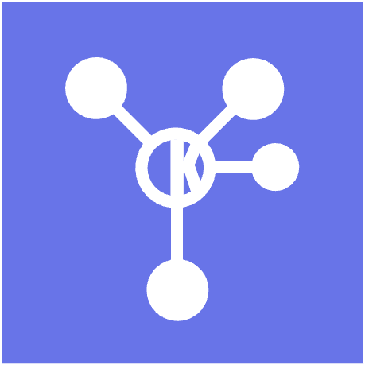
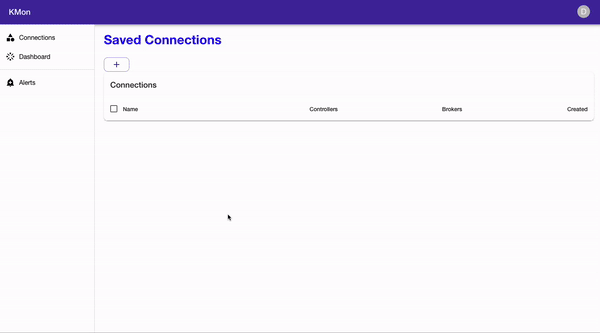
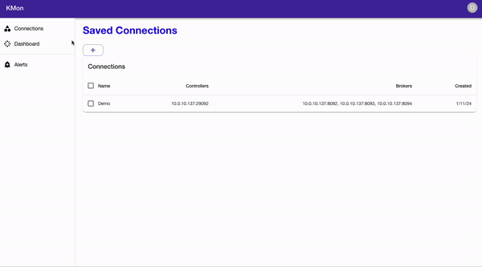

<a id="readme-top"></a>

# KMon

<p align="center">
  
</p>

## Technologies:

[](https://www.javascript.com/)
[](https://html.com/html5/)
[](https://developer.mozilla.org/en-US/docs/Web/CSS)
[](https://nodejs.org/)
[](https://react.dev/)
[](https://expressjs.com/)
[](https://mui.com/)
[](https://jestjs.io/)
[](https://reactrouter.com/)
[](https://webpack.js.org/)
[](https://kafka.apache.org/)
[](https://prometheus.io/)
[](https://grafana.com/)
[](https://www.docker.com/)
[](https://www.electronjs.org/)
[](https://babeljs.io/)
[](https://www.electronjs.org/)


## Introduction:
KMon is a Kafka monitoring tool compatible with **KRaft** mode clusters that allows developers to monitor and set up alerts for their Kafka clusters. KMon also offers customizable dashboards to prioritize or hide desired metrics for engineers. Alerts can also be configured with user emails and/or Slack. KMon is packaged as an Electron app using Docker under the hood for dedicated monitoring OS compatibility.

## Get Started
### Prerequisites:
Must have Docker installed

Clone our repo then run the following commands:
```sh
docker network create monitoring
npm i
npm run build
npm start
```

### Cluster Connection
<p align="center">
  
</p>

### Customizable Dashboard
<p align="center">
  
</p>

## Contributors
Diana Alohkina — <a href='https://www.linkedin.com/in/diana-alokhina/'>LinkedIn</a> | <a href='https://github.com/dianalokada'>Github</a>    
Elliot Cho — <a href='https://www.linkedin.com/in/elliot-hs-cho/'>LinkedIn</a> | <a href='https://github.com/echochs1'>Github</a>  
Darryl Joo — <a href='https://www.linkedin.com/in/darryljoo/'>LinkedIn</a> | <a href='https://github.com/hjdjoo'>Github</a>  
Hudson McLane — <a href='https://www.linkedin.com/in/hudson-mclane/'>LinkedIn</a> | <a href='https://github.com/redferret1'>Github</a>  
Lucy Wu — <a href='https://www.linkedin.com/in/lwu15/'>LinkedIn</a> | <a href='https://github.com/lwu15'>Github</a>


## Links
<a href='https://www.kmon.dev/'>Splash Page</a>  
<a href='https://medium.com/@hjdjoo/kmon-kraft-compatible-kafka-monitoring-cc07dc0f3d04'>Medium article</a>  
<a href='https://www.linkedin.com/company/kmon-dev/'>LinkedIn</a>
